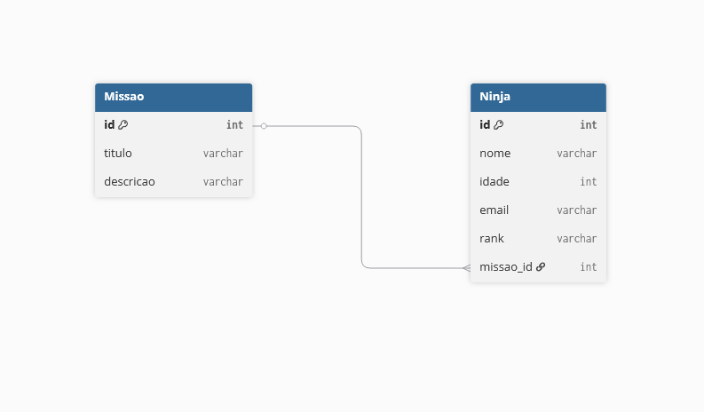

# Sistema de Cadastro de Ninjas

Bem-vindo ao Sistema de Cadastro de Ninjas!
Este projeto é uma aplicação de arquitetura em camadas desenvolvida com Spring Boot, projetada para cadastrar ninjas e suas respectivas missões. O projeto utiliza H2 como banco de dados em memória, Flyway para migrações de banco de dados e segue boas práticas de desenvolvimento de software como controle de versão com Git e hospedagem de repositório no GitHub.

Este sistema foi desenvolvido para gerenciar ninjas e suas missões. Cada ninja pode ser atribuído a uma única missão, enquanto uma missão pode ser associada a vários ninjas. As principais funcionalidades incluem:

---

## 📦 Estrutura do Projeto

```
/
├─ src/
│  ├─ Missoes/
│  │  ├─ Controllers/
│  │  ├─ DTOs/
│  │  ├─ Mappers/
│  │  ├─ Models/
│  │  ├─ Repositories/
│  │  ├─ Services/
│  ├─ Ninjas/
│  │  ├─ Controllers/
│  │  ├─ DTOs/
│  │  ├─ Mappers/
│  │  ├─ Models/
│  │  ├─ Repositories/
│  │  ├─ Services/
│  │
│  ├─ CadastroDeNinjasApplication.java
```

---
Ninja: Contém atributos como id, nome, idade, email e rank. <br>
Missão: Contém atributos como id, título e descrição. <br>
Um Ninja pode ter apenas uma Missão, mas uma Missão pode ser atribuída a vários Ninjas.

## Design do Banco de Dados


---

## Tecnologias Utilizadas


---

## Configuração
1. Clone o repositório:
   ```bash
   git clone git@github.com:matheusgmello/cadastro-de-ninjas.git
    ```
2. Navegue até o diretório do projeto:
   ```bash
   cd cadastro-de-ninjas
   ```
3. Configure as variaveis de ambiente no arquivo `application.properties` e também no IntelliJ. <br><br>

4. Construa o projeto:
   ```bash
    mvn clean install
    ```
5. Execute a aplicação:
    ```bash
     mvn spring-boot:run
     ```
6. Acesse a aplicação em http://localhost:8080
   